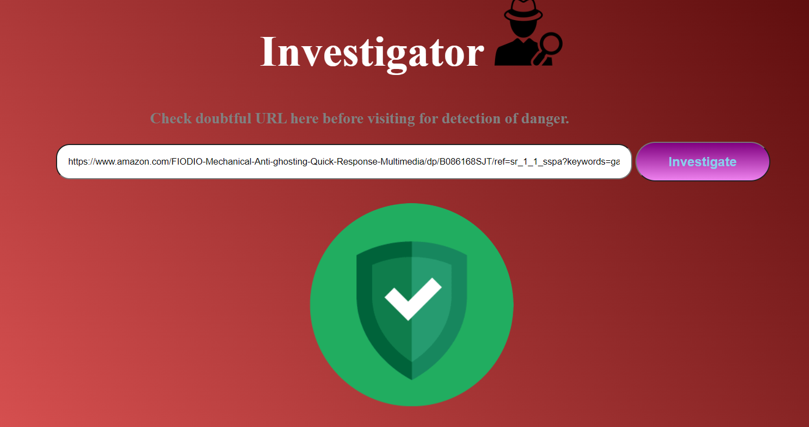
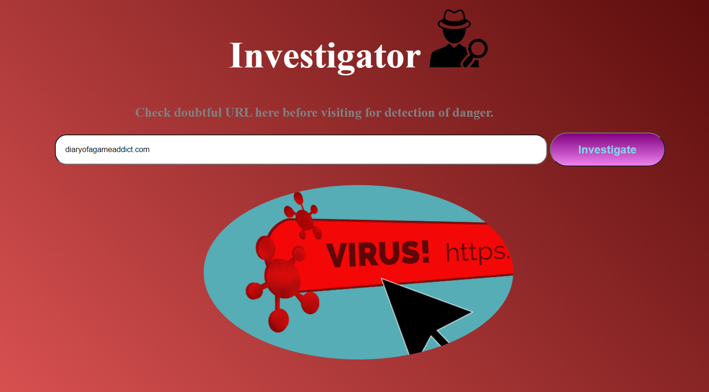

# Malicious_URL_Detection

**The Web App is a utility for detection of any danger looking URL before visiting it. 
The app employs Deep Learning methods to analyse the URL and classify it into a bad or good URL.** 

## TODO
- [x] Create Templates for UI
- [x] Create Backend for request processing using Flask
- [x] Add the feature extraction methods 
- [x] Incorporate Tensorflow 2.0 model for classification
- [ ] Deploy the app on cloud
